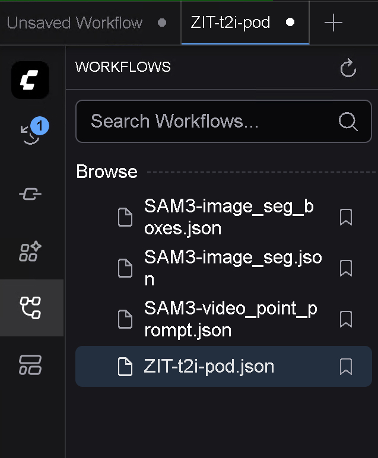
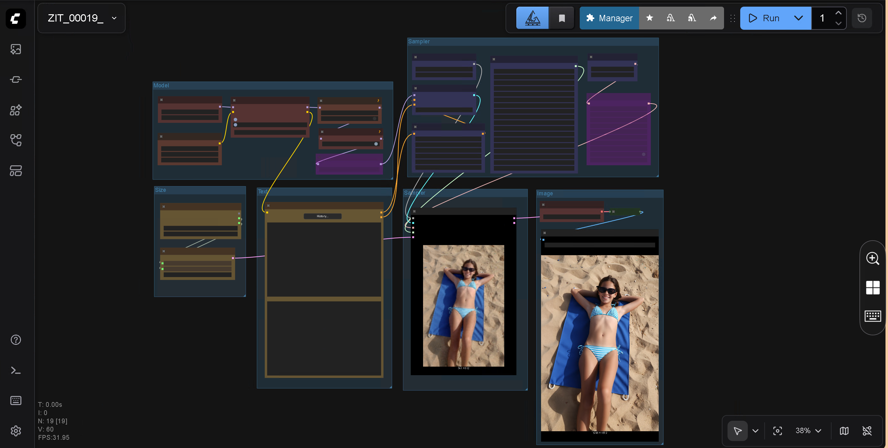

# 📘 Tutorial run-comfyui-image

- This tutorial reflects my own workflow and experience on RunPod.io.
- Always consult the excellent official [runpod.io documentation](https://docs.runpod.io/pods/overview).

## 🚀 Starting a Pod

### 🧩 Choose a Template


Example:

- 👉 [Runpod Z-Image Turbo](https://console.runpod.io/deploy?template=ia5t70hfak&ref=se4tkc5o)
- 👉 [Runpod Flux.2 Dev](https://console.runpod.io/deploy?template=8nl523gts5&ref=se4tkc5o)

Steps:

1. Choose a [GPU](ComfyUI_image_hardware.md)
2. Edit template settings if needed.  
3. Enable volume encryption if desired.  
4. Click **Deploy On-Demand**.

### 📜 Viewing System Logs


- Go to **Logs**.  
- Loading takes **9–15 minutes** depending on region/GPU.  
- If the image doesn’t begin downloading in **1 minute**, delete and redeploy in another region.

Ends with:

```txt
Digest: sha256:2b56bdd14df7af0dae7f9bd7978be9e61d791359f5ea65eedd65dcd2e16752fc
Status: Image is up to date for ls250824/run-comfyui-wan:19112025
```

### 🐳 Viewing Container Logs

```txt
ℹ️ Pod run-comfyui-wan started
ℹ️ Wait until the message 🎉 Provisioning done, ready to create AI content 🎉
```

When you see:

**🎉 Provisioning done, ready to create AI content 🎉**

→ Your pod is ready.

## 🔌 Connecting to Your Pod

[Docs](https://docs.runpod.io/pods/connect-to-a-pod)


### 🎨 ComfyUI

1. Select tab **Connect** → **ComfyUI**
2. Set username/password
3. Load a workflow  
4. Press **Run**  
5. Monitor GPU/RAM via **Telemetry**





## 💻 Web Terminal


- Select tab **Connect**
- Enable **web terminal**  
- Provides terminal access directly in your browser.

## 🔐 Secrets

[Docs](https://docs.runpod.io/pods/templates/secrets#manage-secrets)

Useful secrets:

- `PASSWORD`
- `CIVITAI_TOKEN`
- `HF_TOKEN`

## 🧑‍💻 Code-Server Login


If no "PASSWORD" was set open the web terminal and enter.

```bash
cat /root/.config/code-server/config.yaml
```

Copy the password → log in via the Code-Server service on tab **Connect**.

## 📥 Downloading Models and LoRAs

From web terminal or Code-Server.

### 🧩 CivitAI

If no "CIVITAI_TOKEN" was set, create or use a free token from the civitai website.

```bash
export CIVITAI_TOKEN="xxxxx"
```

Download example from [CivitAI](https://civitai.com/models/2071400?modelVersionId=2344329)

```bash
civitai "https://civitai.com/api/download/models/2377549?type=Model&format=SafeTensor" /workspace/ComfyUI/models/loras/
civitai "https://civitai.com/api/download/models/2377566?type=Model&format=SafeTensor" /workspace/ComfyUI/models/loras/
```

Refresh ComfyUI using key **r**.

### ☁️ HuggingFace

"HF_TOKEN" is mandatory but needed for gated sites and upload.

Login:

```bash
hf auth login --token xxxxx
```

or set token:

```bash
export HF_TOKEN="xxxxx"
```

Download example from [Huggingface](https://huggingface.co/ricecake/wan21NSFWClipVisionH_v10/tree/main).

```bash
hf download ricecake/wan21NSFWClipVisionH_v10 wan21NSFWClipVisionH_v10.safetensors --local-dir /workspace/ComfyUI/models/clip_vision
```

Refresh ComfyUI using key **r**.

## 🔄 Uploading & Downloading Files

### ☁️ Cloud Sync

- [Docs](https://docs.runpod.io/pods/storage/cloud-sync)

#### Free dropbox


- Reliable and fast upload and download for large files.
- Go to [Dropbox developers](https://www.dropbox.com/developers)
- **Create an app** to connect with runpod.io.

### 📦 runpodctl  

- [Docs](https://docs.runpod.io/runpodctl/overview)

#### Speed

- **Fine** for **downloading** files from your pod.
- **Problematic** for **uploading large files** to your pod with slow connections (timeouts).
- Perfect for transfering files between pods.

#### Installation

- You need to install a client on your local computer.
- You do **not** need an api key to upload/download to/from your pod.

## 🔧 Advanced Features

### 🔐 SSH / SCP / SFTP

[Docs](https://docs.runpod.io/pods/configuration/use-ssh).

#### Key generation
- Linux has ssh-keygen already installed to generate keys.
- Windows install [Git](https://git-scm.com/install/windows) to get ssh-keygen.
- Put your **public key** on runpod.io keep your **private key** on your local computer.

#### Apps.

- Use [Shellfish](https://secureshellfish.app), [Putty](https://www.chiark.greenend.org.uk/~sgtatham/putty/), [Tabby terminal](https://tabby.sh/) or shell/bash.
- File transfer [Shellfish](https://secureshellfish.app) or [WinSCP](https://winscp.net/).

## 🔑 RunPod API

Useful when the web console is out (examples are outages from AWS and Cloudflare).

#### Using runpod.io API

- [Docs](https://docs.runpod.io/api-reference/overview).
- Install with "sudo apt install curl" on Ubuntu.

```bash
curl --request GET \
  --url https://rest.runpod.io/v1/pods \
  --header 'Authorization: Bearer <api-key>'

curl --request POST \
  --url https://rest.runpod.io/v1/pods/{podId}/stop \
  --header 'Authorization: Bearer <api-key>'

curl --request DELETE \
  --url https://rest.runpod.io/v1/pods/{podId} \
  --header 'Authorization: Bearer <api-key>'
```

#### Using runpodctl to start/stop your pod with your api key.

- [Docs](https://docs.runpod.io/runpodctl/overview).
- Install client on local computer.
- Use Shell/PowerShell or Bash.

```bash
runpodctl config --apiKey <YOUR_API_KEY>

runpodctl get pod --allfields

runpodctl stop pod <pod_id>

runpodctl remove pod <pod_id>
```
